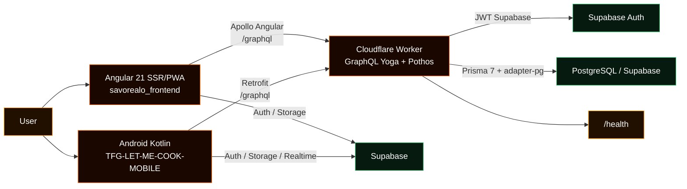
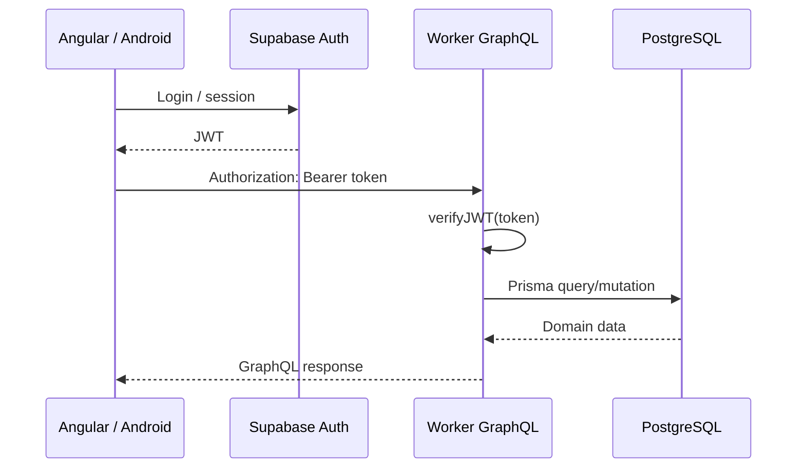

<div align="center">


<br />


<br /><br />


&nbsp;

&nbsp;

&nbsp;

&nbsp;


<br /><br />

<a href="https://gamma.app/docs/REWE-Digital-uiu9k0grzfewlti?mode=doc">
  
</a>

<br /><br />

<!-- Language switcher -->
<a href="./README.md">
  
</a>
&nbsp;


<br /><br />


</div>

## Project summary

**Savorealo** is a gastronomic social network focused on discovering, saving, publishing and cooking recipes, with social experiences such as profiles, followers, comments, saves, messages, places and AI recipe generation.

The project is divided into three main applications:

| Part | Repository | Purpose |
|---|---|---|
| **Web frontend** | [`savorealo/savorealo_frontend`](https://github.com/savorealo/savorealo_frontend) | Angular 21 app with SSR, PWA, Apollo Angular, PrimeNG, Tailwind CSS and Supabase on the client. |
| **Backend** | [`savorealo/api`](https://github.com/savorealo/api) | GraphQL API deployed on Cloudflare Workers with GraphQL Yoga, Pothos, Prisma 7 and PostgreSQL/Supabase. |
| **Android Mobile** | [`acanojiDev/TFG-LET-ME-COOK-MOBILE`](https://github.com/acanojiDev/TFG-LET-ME-COOK-MOBILE.git) | Native Android app with Kotlin, Jetpack Compose, Hilt, Room, Supabase and Retrofit. |

The web frontend and the Android app consume the backend GraphQL API and use Supabase for authentication and storage. The backend validates the Supabase JWT and resolves domain operations against PostgreSQL.

<div align="center">
  
</div>

## Development team

All three developers contributed across every part of the project — web frontend, backend and Android app — with no exclusive assignment to a single layer.

| Name | Contribution |
|---|---|
| **Adrián Romero Maldonado** | Web frontend · Backend · Android Mobile |
| **Antonio Lorenzo Cano Jiménez** | Web frontend · Backend · Android Mobile |
| **José María López González** | Web frontend · Backend · Android Mobile |

<div align="center">
  
</div>

## Table of contents

- [Main features](#main-features)
- [Module contributions](#module-contributions)
- [Architecture](#architecture)
- [Tech stack](#tech-stack)
- [Main workflows](#main-workflows)
- [Repository structure](#repository-structure)
- [Installation and configuration](#installation-and-configuration)
- [Running in development](#running-in-development)
- [Build and deployment](#build-and-deployment)
- [Testing and quality](#testing-and-quality)
- [Important notes](#important-notes)

<div align="center">
  
</div>

## Main features

### Web frontend

| Route | Page |
|---|---|
| `/auth` | Login and registration. |
| `/` | Main feed. |
| `/explore` | Content exploration. |
| `/ai` | AI recipe generation (history and settings). |
| `/generar-receta` | AI recipe agent (step-by-step generation). |
| `/saved` | Saved posts. |
| `/chat` | Messages. |
| `/profile` | Own profile. |
| `/profile/:username` | Public profile. |
| `/settings` | Settings. |
| `/post/:id` | Post or recipe detail. |
| `/cook/:id` | Cooking mode. |
| `/notifications` | Notifications. |
| `/shopping` | Shopping list. |
| `/places` | Gastronomic places. |
| `/places/:id` | Place detail. |

The app is organised by domain pages and components in `src/app/features/`. The repositories in `src/app/core/repositories/` combine GraphQL and Supabase as appropriate: GraphQL for domain data and Supabase for session, storage or direct client capabilities.

### Android Mobile

Main screens and routes defined in `ui/navigation/Routes.kt`:

| Compose route | Screen |
|---|---|
| `Login` | User login. |
| `Register` | Registration. |
| `CompleteProfile` | Complete profile after sign-up or social login. |
| `Home` | Main mobile feed. |
| `Explore` | Posts and users exploration. |
| `Generator` | Recipe generator. |
| `Profile` | Own profile. |
| `UserProfile(userId)` | Another user's profile. |
| `Camera(mode)` | Camera for posts or other multimedia flows. |
| `PostDetail(postId)` | Post detail. |
| `Notifications` | Notifications. |
| `Messages(pendingUserId)` | Message list or start conversation. |
| `Conversation(conversationId, otherUserId, otherUserName)` | Direct conversation. |
| `Following(userId)` / `Followers(userId)` | Social lists. |
| `Settings` | Settings. |

The mobile app follows a clear separation between `remote` and `repository`: remote APIs talk to Supabase or GraphQL, while repositories apply business rules, transform data and manage errors. Room provides local persistence for generated recipes, WorkManager supports deferred tasks and Hilt centralises dependency injection.

### Backend

| Endpoint | Description |
|---|---|
| `/graphql` | Main GraphQL API. |
| `/health` | JSON health check with status and timestamp. |

Notable operations:

| Operation | Type | Description |
|---|---|---|
| `checkUsername` | Query | Checks username availability. |
| `searchUsers` | Query | Searches users. |
| `user` | Query | Returns user data. |
| `suggestedUsers` | Query | Suggests profiles to follow. |
| `feed`, `discoverFeed`, `userPosts` | Query | Retrieve posts for different contexts. |
| `notifications`, `pendingFollowRequests` | Query | Notifications and pending requests. |
| `updateProfile` | Mutation | Updates the user's profile. |
| `toggleFollow` | Mutation | Follow or unfollow a user. |
| `respondFollowRequest` | Mutation | Accept or reject a follow request. |
| `toggleSave` | Mutation | Save or unsave a post. |
| `toggleLike` | Mutation | Like or unlike a post. |
| `addComment`, `deleteComment` | Mutation | Manage comments. |
| `generateRecipe`, `createRecipePost` | Mutation | Generate or publish recipes. |

The backend classifies and translates database errors in `src/lib/errors.ts` to avoid exposing technical messages to the client.

<div align="center">
  
</div>

## Module contributions

The project transversally covers the following modules of the training programme:

### English

The entire codebase is written in English: variable names, functions, classes, constants, technical comments, API error messages and the GraphQL schema. The app supports English as one of its 14 interface languages, with a static translation system (`TranslationService`) and dynamic translation of user-generated content (`ContentTranslationService` + MyMemory API). The main README of the `savorealo/savorealo` repository is also available in English (`README.en.md`).

### IPE — Vocational Training and Career Guidance

The project demonstrates professional team organisation: division of roles and responsibilities among three developers, use of Git branches and pull requests to integrate changes, definition of environments (development, production), management of secrets and environment variables to avoid exposing credentials, and automated CI/CD pipeline. The layered architecture and Repository pattern apply principles of single responsibility and separation of concerns found in real work environments.

### Services and Processes — Android

The Android app implements background tasks with **WorkManager**: `PostUploadWorker` for deferred post uploads when connectivity is restored, and `ReminderWorker` for periodic reminders of saved recipes. Both workers use network constraints and are automatically restarted if the process is interrupted, following Android guidelines for deferred and persistent tasks.

### Mobile Device Programming — Android

Native Android application developed with **Kotlin 2.2** and **Jetpack Compose**: declarative UI with Material 3, type-safe navigation with Navigation Compose, dependency injection with **Hilt** + KSP, local persistence with **Room**, photo capture with **CameraX**, authentication and real-time with **Supabase KT** and consumption of the GraphQL API with **Retrofit + OkHttp**. The architecture clearly separates Remote Data Sources (API communication) from Repositories (business logic), following Clean Architecture.

### Data Access

The project combines multiple data access strategies. On the backend, **Prisma 7** acts as a type-safe ORM over **PostgreSQL (Supabase)**, with Prisma Accelerate for connection pooling at the edge. In the Android app, **Room** provides local persistence with DAOs and migrations, enabling offline operation for generated recipes. The frontend accesses domain data via **Apollo Angular** (GraphQL) and authentication/storage directly via **Supabase JS**. The Repository pattern abstracts the data source from business services.

### Interface Development

The web frontend implements a complete interface with **PrimeNG 21** (UI components) and **Tailwind CSS 3** (style utilities), with dark/light mode managed by `ThemeService` via `data-theme` on the root element and CSS tokens in `styles/tokens.css`. The Android app uses **Jetpack Compose** with **Material 3**, a custom theme and dark mode support. Both interfaces are responsive, support RTL for Arabic, and include animations, skeleton loaders and loading indicators.

### Servers and APIs

The backend is a **GraphQL API** deployed as a **Cloudflare Worker** (edge serverless) with **GraphQL Yoga** + **Pothos** (code-first schema with Prisma and Relay plugins). It exposes a single `POST /graphql` endpoint with Relay pagination for infinite lists, authentication via JWT verified with HMAC-SHA256, structured error handling (`src/lib/errors.ts`) and a `GET /health` endpoint for monitoring. Deployment is continuous via `wrangler deploy` and network, CORS and context configuration is managed in `src/index.ts`.

### Enterprise Management System

Savorealo includes support for **gastronomic business** profiles (`UserType: RESTAURANT`, `BAR`) with specific fields such as `specialty`, `phone` and `website` in `business_profiles`. The **Places** section (`/places`) allows discovering and reviewing restaurants, bars, cafés and food trucks with filters by cuisine type. The **AI** module (`generateRecipe`, `myGenerations`) represents a value-added service for the business. The backend includes a **notifications** system, **personalised feed with scoring** (engagement + affinity + freshness) and **direct messaging** as community management and retention tools.

<div align="center">
  
</div>

## Architecture



<div align="center">
  
</div>

## Tech stack

| Web frontend | Backend | Android Mobile |
|---|---|---|
| Angular 21 | Cloudflare Workers | Kotlin 2.2 |
| Apollo Angular + GraphQL | Wrangler | Jetpack Compose |
| Supabase JS | GraphQL Yoga | Material 3 |
| PrimeNG + PrimeIcons | Pothos | Navigation Compose |
| Tailwind CSS | Prisma 7 | Hilt + KSP |
| SSR with `@angular/ssr` | `@prisma/adapter-pg` | Room |
| PWA with Angular Service Worker | PostgreSQL / Supabase | Supabase KT |
| Vitest | Supabase JWT Auth | Retrofit + OkHttp |
| ESLint + Prettier | Vitest | CameraX |
| Husky + lint-staged | TypeScript | WorkManager |

<div align="center">
  
</div>

## Main workflows

<div align="center">
  
</div>



<div align="center">
  
</div>

<div align="center">
  
</div>

## Repository structure

```text
tfg/
├── savorealo/
│   ├── README.md
│   └── docs/
│       ├── assets/
│       └── diagrams/
├── savorealo_frontend/
│   ├── src/app/
│   │   ├── core/
│   │   ├── features/
│   │   ├── graphql/
│   │   └── shared/
│   ├── src/environments/
│   └── package.json
├── api/
│   ├── src/
│   │   ├── index.ts
│   │   ├── lib/
│   │   ├── schema/
│   │   └── services/
│   ├── prisma/
│   ├── wrangler.jsonc
│   └── package.json
└── TFG-LET-ME-COOK-MOBILE/
    ├── app/src/main/java/es/PapayaSA/letmecook/
    │   ├── data/
    │   ├── di/
    │   ├── ui/
    │   ├── utils/
    │   └── worker/
    ├── app/build.gradle.kts
    └── gradle/libs.versions.toml
```

**Web frontend**

| Folder | Description |
|---|---|
| `src/app/` | Angular application core: routes, configuration and functional layout. |
| `src/app/features/` | Domain pages: feed, auth, explore, AI, saved, chat, profile, settings, places and shopping. |
| `src/app/core/` | Guards, interceptors, models, repositories, services, store, tokens and shared utilities. |
| `src/app/graphql/` | GraphQL operations used from Apollo Angular. |

**Backend**

| Folder | Description |
|---|---|
| `src/index.ts` | Worker entry point: CORS, `/graphql`, `/health`, GraphQL context, JWT auth and error handling. |
| `src/lib/` | Authentication, Prisma and error classification utilities. |
| `src/schema/` | Code-first GraphQL schema with Pothos, organised by domain. |
| `src/services/` | Application services for reusable logic. |

**Android Mobile**

| Folder | Description |
|---|---|
| `app/.../data/` | Models, remote APIs, repositories and local persistence with Room. |
| `app/.../di/` | Hilt modules for Supabase, Retrofit, Room and application dependencies. |
| `app/.../ui/` | Jetpack Compose screens, navigation, theme and shared components. |
| `app/.../utils/` | Constants, image and language utilities. |
| `app/.../worker/` | Workers for reminders and deferred post uploads. |

<div align="center">
  
</div>

## Installation and configuration

Clone the repositories:

```bash
git clone https://github.com/savorealo/savorealo_frontend.git
git clone https://github.com/savorealo/api.git
git clone https://github.com/acanojiDev/TFG-LET-ME-COOK-MOBILE.git
```

Install dependencies:

```bash
cd savorealo_frontend && npm install
cd api && npm install
cd TFG-LET-ME-COOK-MOBILE && ./gradlew tasks
```

### Environment variables

**Frontend** — `savorealo_frontend/src/environments/environment.ts`:

```ts
export const environment = {
  production: false,
  supabaseUrl: 'https://<project-ref>.supabase.co',
  supabaseKey: '<supabase-anon-key>',
  apiUrl: 'http://localhost:8787',  // or https://develop.app.savorealo.com/api in production
}
```

**Backend** — `api/.dev.vars` (Wrangler) and `api/.env` (Prisma CLI):

```bash
# .dev.vars
DATABASE_URL=prisma+postgres://accelerate.prisma-data.net/?api_key=YOUR_KEY
SUPABASE_JWT_SECRET=your-jwt-secret
ENVIRONMENT=development

# .env
DATABASE_URL=postgresql://...@pooler.supabase.com:6543/postgres?pgbouncer=true
DIRECT_URL=postgresql://...@pooler.supabase.com:5432/postgres
```

| Variable | Usage |
|---|---|
| `DATABASE_URL` | Worker connection (or Hyperdrive if available). |
| `DIRECT_URL` | Direct connection for Prisma CLI, migrations and generation. |
| `SUPABASE_JWT_SECRET` | Secret for verifying Supabase Auth tokens. |
| `ENVIRONMENT` | In production, requires an authenticated user for all operations. |

**Android Mobile** — `utils/Constants.kt`:

```kotlin
const val URL = "https://develop.app.savorealo.com/api/"  // production
// const val URL = "http://10.0.2.2:8787/"                // local emulator
// const val URL = "http://<LAN_IP>:8787/"                // physical device
```

> Sensitive keys must not be committed to the repository. Use Cloudflare/Supabase secrets and local files ignored by Git.

<div align="center">
  
</div>

## Running in development

| Application | Command | URL |
|---|---|---|
| **Web frontend** | `cd savorealo_frontend && npm start` | http://localhost:4200 |
| **Backend (tsx)** | `cd api && npm run dev` | http://localhost:8787/graphql |
| **Backend (Wrangler)** | `cd api && npm start` | http://localhost:8787/graphql |
| **Android Mobile** | `cd TFG-LET-ME-COOK-MOBILE && ./gradlew installDebug` | Device/emulator |

The backend also exposes a health check at `http://localhost:8787/health`.

For full local development: start the backend first and make sure `apiUrl` in the frontend points to `http://localhost:8787`. From the Android emulator use `http://10.0.2.2:8787/`; from a physical device, use the machine's LAN IP.

<div align="center">
  
</div>

## Build and deployment

**Web frontend**

```bash
cd savorealo_frontend
npm run build             # Standard build
npm run build:prod        # Build with production configuration
npm run build:cloudflare  # Build for Cloudflare Pages
npm run serve:ssr:cookeealo  # Serve the SSR bundle locally
```

**Backend**

```bash
cd api
npm run deploy      # Publish the Worker with Wrangler
npm run cf-typegen  # Regenerate Cloudflare types from wrangler.jsonc
```

In production, verify that `ENVIRONMENT`, `SUPABASE_JWT_SECRET`, database and Hyperdrive are configured before deploying.

**Android Mobile**

```bash
cd TFG-LET-ME-COOK-MOBILE
./gradlew assembleDebug    # Debug APK
./gradlew assembleRelease  # Release APK/AAB (requires keystore)
```

The Android build uses `compileSdk 36`, `minSdk 34`, `targetSdk 36` and `applicationId es.PapayaSA.letmecook`. Before a real release, review signing, obfuscation, secrets and Supabase/Google configuration.

<div align="center">
  
</div>

## Testing and quality

| Application | Command | Tool |
|---|---|---|
| Frontend — tests | `npm test` | Vitest |
| Frontend — coverage | `npm run test:cov` | Vitest |
| Frontend — lint | `npm run lint` | ESLint |
| Frontend — format | `npm run format` | Prettier |
| Backend — tests | `npm test` | Vitest |
| Mobile — unit tests | `./gradlew test` | JUnit |
| Mobile — instrumented tests | `./gradlew connectedAndroidTest` | Espresso |

The frontend includes Husky + lint-staged to run lint and tests on every commit. Android centralises versions in `gradle/libs.versions.toml` and uses Gradle Wrapper for reproducible builds.

### GraphQL request example

```bash
curl http://localhost:8787/graphql \
  -H "Content-Type: application/json" \
  -H "Authorization: Bearer <token>" \
  -d '{
    "query": "query SearchUsers($q: String!) { searchUsers(query: $q) { id username avatarUrl } }",
    "variables": { "q": "adrian" }
  }'
```

<div align="center">
  
</div>

## Important notes

- Do not commit secrets, JWT secrets, private database URLs or service keys.
- On mobile, avoid hardcoding Supabase or Google keys in source code before publishing builds.
- For full local development, start the backend at `http://localhost:8787` first and adjust the frontend `apiUrl`.
- For Android Emulator, point the local URL to `http://10.0.2.2:8787/`; for a physical device, use the machine's LAN IP.
- Database errors are translated into controlled messages for the client with consistent GraphQL/HTTP codes.
- `summary.md` contains internal working notes and is not part of the final project documentation.

<div align="center">


<br />

<strong>Savorealo</strong><br />
Angular 21 SSR/PWA · Android Kotlin · GraphQL Yoga · Pothos · Prisma 7 · Cloudflare Workers · Supabase

<br /><br />


</div>
