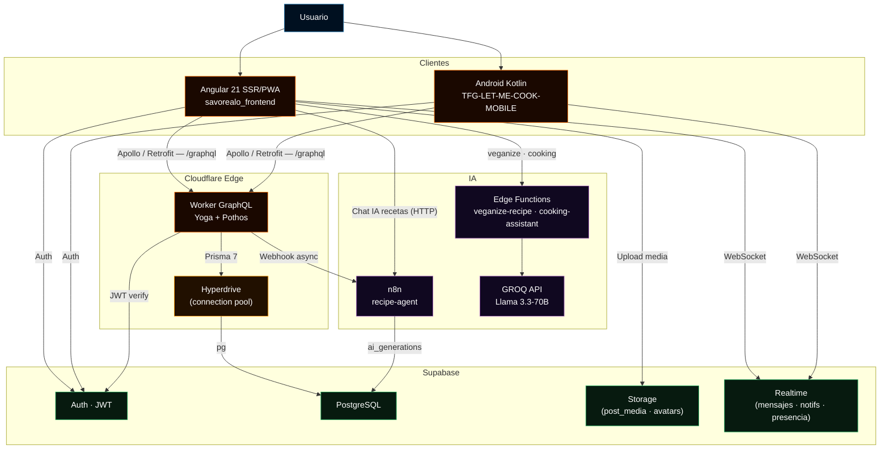
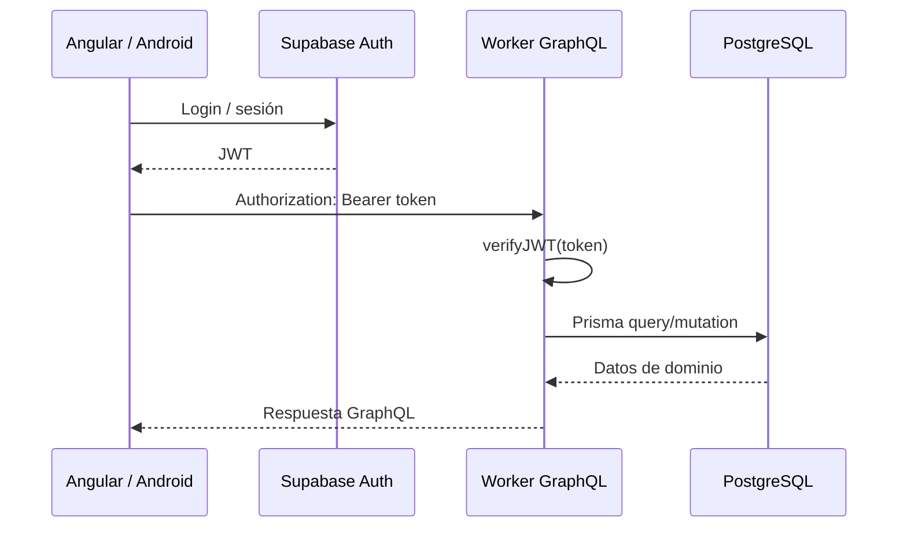

<div align="center">


<br />


<br /><br />


&nbsp;

&nbsp;

&nbsp;

&nbsp;


<br /><br />

<a href="https://gamma.app/docs/REWE-Digital-uiu9k0grzfewlti?mode=doc">
  
</a>

<br /><br />


</div>

## Resumen del proyecto

**Savorealo** es una red social gastronómica centrada en descubrir, guardar, publicar y cocinar recetas, con experiencias sociales como perfiles, seguidores, comentarios, guardados, mensajes, lugares y generación de recetas con IA.

El proyecto está dividido en tres aplicaciones principales:

| Parte | Repositorio | Propósito |
|---|---|---|
| **Frontend web** | [`savorealo/savorealo_frontend`](https://github.com/savorealo/savorealo_frontend) | App Angular 21 con SSR, PWA, Apollo Angular, PrimeNG, Tailwind CSS y Supabase en cliente. |
| **Backend** | [`savorealo/api`](https://github.com/savorealo/api) | API GraphQL desplegada en Cloudflare Workers con GraphQL Yoga, Pothos, Prisma 7 y PostgreSQL/Supabase. |
| **Mobile Android** | [`acanojiDev/TFG-LET-ME-COOK-MOBILE`](https://github.com/acanojiDev/TFG-LET-ME-COOK-MOBILE.git) | App Android nativa con Kotlin, Jetpack Compose, Hilt, Room, Supabase y Retrofit. |

El frontend web y la app Android consumen la API GraphQL del backend y usan Supabase para autenticación, almacenamiento y mensajería en tiempo real. El backend (Cloudflare Worker) valida el JWT de Supabase, resuelve operaciones de dominio contra PostgreSQL a través de **Cloudflare Hyperdrive** (connection pooling en el edge), y delega la generación de recetas IA a **n8n** vía webhook asíncrono. El frontend invoca además las **Supabase Edge Functions** (`veganize-recipe`, `cooking-assistant`) respaldadas por **GROQ Llama 3.3-70B** para funcionalidades de IA en tiempo real.

<div align="center">
  
</div>

## Equipo de desarrollo

Los tres desarrolladores han contribuido de forma transversal a todas las partes del proyecto: frontend web, backend y aplicación Android. No hay una asignación exclusiva por capa.

| Nombre | Contribución |
|---|---|
| **Adrián Romero Maldonado** | Frontend web · Backend · Mobile Android |
| **Antonio Lorenzo Cano Jiménez** | Frontend web · Backend · Mobile Android |
| **José María López González** | Frontend web · Backend · Mobile Android |

<div align="center">
  
</div>

## Índice

- [Funcionalidades principales](#funcionalidades-principales)
- [Aportación por módulos](#aportación-por-módulos)
- [Arquitectura](#arquitectura)
- [Stack tecnológico](#stack-tecnológico)
- [Workflows principales](#workflows-principales)
- [Estructura del repositorio](#estructura-del-repositorio)
- [Instalación y configuración](#instalación-y-configuración)
- [Ejecución en desarrollo](#ejecución-en-desarrollo)
- [Construcción y despliegue](#construcción-y-despliegue)
- [Testing y calidad](#testing-y-calidad)
- [Notas importantes](#notas-importantes)

<div align="center">
  
</div>

## Funcionalidades principales

### Frontend web

| Ruta | Página |
|---|---|
| `/auth` | Acceso y registro. |
| `/` | Feed principal. |
| `/explore` | Exploración de contenido. |
| `/ai` | Generación de recetas con IA (historial y ajustes). |
| `/generar-receta` | Agente de recetas con IA (generación paso a paso). |
| `/saved` | Publicaciones guardadas. |
| `/chat` | Mensajes. |
| `/profile` | Perfil propio. |
| `/profile/:username` | Perfil público. |
| `/settings` | Ajustes. |
| `/post/:id` | Detalle de publicación o receta. |
| `/cook/:id` | Modo cocina. |
| `/notifications` | Notificaciones. |
| `/shopping` | Lista de la compra. |
| `/places` | Lugares gastronómicos. |
| `/places/:id` | Detalle de lugar. |

La app está organizada por páginas y componentes de dominio en `src/app/features/`. Los repositorios de `src/app/core/repositories/` combinan GraphQL y Supabase según el caso: GraphQL para datos de dominio y Supabase para sesión, almacenamiento o capacidades directas del cliente.

### Mobile Android

Pantallas y rutas principales definidas en `ui/navigation/Routes.kt`:

| Ruta Compose | Pantalla |
|---|---|
| `Login` | Acceso de usuario. |
| `Register` | Registro. |
| `CompleteProfile` | Completar perfil tras alta o login social. |
| `Home` | Feed principal móvil. |
| `Explore` | Exploración de publicaciones y usuarios. |
| `Generator` | Generador de recetas. |
| `Profile` | Perfil propio. |
| `UserProfile(userId)` | Perfil de otro usuario. |
| `Camera(mode)` | Cámara para posts u otros flujos multimedia. |
| `PostDetail(postId)` | Detalle de publicación. |
| `Notifications` | Notificaciones. |
| `Messages(pendingUserId)` | Listado o inicio de mensajes. |
| `Conversation(conversationId, otherUserId, otherUserName)` | Conversación directa. |
| `Following(userId)` / `Followers(userId)` | Listas sociales. |
| `Settings` | Ajustes. |

La app móvil sigue una separación clara entre `remote` y `repository`: los APIs remotos hablan con Supabase o GraphQL, mientras que los repositorios aplican reglas de negocio, transforman datos y gestionan errores. Room permite persistencia local para recetas generadas, WorkManager soporta tareas diferidas y Hilt centraliza la inyección de dependencias.

### Backend

| Endpoint | Descripción |
|---|---|
| `/graphql` | API GraphQL principal. |
| `/health` | Health check JSON con estado y timestamp. |

Operaciones destacadas:

| Operación | Tipo | Descripción |
|---|---|---|
| `checkUsername` | Query | Comprueba disponibilidad de nombre de usuario. |
| `searchUsers` | Query | Busca usuarios. |
| `user` | Query | Devuelve datos de un usuario. |
| `suggestedUsers` | Query | Sugiere perfiles a seguir. |
| `feed`, `discoverFeed`, `userPosts` | Query | Recuperan publicaciones para distintos contextos. |
| `notifications`, `pendingFollowRequests` | Query | Notificaciones y solicitudes pendientes. |
| `updateProfile` | Mutation | Actualiza el perfil del usuario. |
| `toggleFollow` | Mutation | Sigue o deja de seguir a un usuario. |
| `respondFollowRequest` | Mutation | Acepta o rechaza una solicitud de seguimiento. |
| `toggleSave` | Mutation | Guarda o elimina una publicación guardada. |
| `toggleLike` | Mutation | Marca o desmarca un like. |
| `addComment`, `deleteComment` | Mutation | Gestiona comentarios. |
| `generateRecipe`, `createRecipePost` | Mutation | Genera o publica recetas. |

El backend clasifica y traduce errores de base de datos en `src/lib/errors.ts` para evitar exponer mensajes técnicos al cliente.

<div align="center">
  
</div>

## Aportación por módulos

El proyecto cubre de forma transversal los siguientes módulos del ciclo formativo:

### Inglés

Toda la base de código está escrita en inglés: nombres de variables, funciones, clases, constantes, comentarios técnicos, mensajes de error de la API y esquema GraphQL. La app soporta inglés como uno de sus 14 idiomas de interfaz, con un sistema de traducción estática (`TranslationService`) y traducción dinámica de contenido generado por usuarios (`ContentTranslationService` + MyMemory API). El README principal del repositorio `savorealo/savorealo` está disponible también en inglés (`README.en.md`).

### IPE — Formación y Orientación Laboral

El proyecto demuestra una organización profesional del trabajo en equipo: división de roles y responsabilidades entre tres desarrolladores, uso de ramas Git y pull requests para integrar cambios, definición de entornos (desarrollo, producción), gestión de secrets y variables de entorno para no exponer credenciales, y pipeline de CI/CD automatizado. La arquitectura por capas y el patrón Repository aplican principios de responsabilidad única y separación de intereses propios de entornos laborales reales.

### Servicios y Procesos — Android

La app Android implementa tareas en segundo plano con **WorkManager**: `PostUploadWorker` para subida diferida de publicaciones cuando se recupera conectividad, y `ReminderWorker` para recordatorios periódicos de recetas guardadas. Ambos workers usan constraints de red y se relanzan automáticamente si el proceso es interrumpido, siguiendo las guías de Android para tareas diferidas y persistentes.

### Programación de Dispositivos Móviles — Android

Aplicación Android nativa desarrollada con **Kotlin 2.2** y **Jetpack Compose**: interfaz declarativa con Material 3, navegación type-safe con Navigation Compose, inyección de dependencias con **Hilt** + KSP, persistencia local con **Room**, captura de fotografías con **CameraX**, autenticación y tiempo real con **Supabase KT** y consumo de la API GraphQL con **Retrofit + OkHttp**. La arquitectura separa claramente Remote Data Sources (comunicación con APIs) de Repositories (lógica de negocio), siguiendo Clean Architecture.

### Acceso a Datos

El proyecto combina múltiples estrategias de acceso a datos. En el backend, **Prisma 7** actúa como ORM type-safe sobre **PostgreSQL (Supabase)**, con Prisma Accelerate para connection pooling en el edge. En la app Android, **Room** proporciona persistencia local con DAOs y migraciones, permitiendo funcionamiento offline para recetas generadas. El frontend accede a datos de dominio vía **Apollo Angular** (GraphQL) y a autenticación/storage directamente vía **Supabase JS**. El patrón Repository abstrae el origen de los datos para los servicios de negocio.

### Desarrollo de Interfaces

El frontend web implementa una interfaz completa con **PrimeNG 21** (componentes de UI) y **Tailwind CSS 3** (utilidades de estilos), con modo oscuro/claro gestionado por `ThemeService` mediante `data-theme` en el elemento raíz y tokens CSS en `styles/tokens.css`. La app Android usa **Jetpack Compose** con **Material 3**, tema personalizado y soporte de modo oscuro. Ambas interfaces son responsivas, soportan RTL para árabe, y cuentan con animaciones, skeleton loaders e indicadores de carga.

### Servidores y APIs

El backend es una **API GraphQL** desplegada como **Cloudflare Worker** (edge serverless) con **GraphQL Yoga** + **Pothos** (schema code-first con plugins Prisma y Relay). Expone un único endpoint `POST /graphql` con paginación Relay para listas infinitas, autenticación mediante JWT verificado con HMAC-SHA256, manejo estructurado de errores (`src/lib/errors.ts`) y un endpoint `GET /health` para monitorización. El despliegue es continuo vía `wrangler deploy` y la configuración de red, CORS y contexto se gestiona en `src/index.ts`.

### Sistema de Gestión Empresarial

Savorealo incluye soporte para perfiles de **negocios gastronómicos** (`UserType: RESTAURANT`, `BAR`) con campos específicos como `specialty`, `phone` y `website` en `business_profiles`. La sección **Lugares** (`/places`) permite descubrir y reseñar restaurantes, bares, cafeterías y food trucks con filtros por tipo de cocina. El módulo de **IA** (`generateRecipe`, `myGenerations`) representa un servicio de valor añadido para el negocio. El backend incluye un sistema de **notificaciones**, **feed personalizado con scoring** (engagement + afinidad + frescura) y **mensajería directa** como herramientas de gestión de comunidad y fidelización.

<div align="center">
  
</div>

## Arquitectura



<div align="center">
  
</div>

## Stack tecnológico

| Frontend web | Backend | Mobile Android |
|---|---|---|
| Angular 21 | Cloudflare Workers | Kotlin 2.2 |
| Apollo Angular + GraphQL | Wrangler | Jetpack Compose |
| Supabase JS | GraphQL Yoga | Material 3 |
| PrimeNG + PrimeIcons | Pothos | Navigation Compose |
| Tailwind CSS | Prisma 7 | Hilt + KSP |
| SSR con `@angular/ssr` | `@prisma/adapter-pg` | Room |
| PWA con Angular Service Worker | PostgreSQL / Supabase | Supabase KT |
| Vitest | Supabase JWT Auth | Retrofit + OkHttp |
| ESLint + Prettier | Vitest | CameraX |
| Husky + lint-staged | TypeScript | WorkManager |

<div align="center">
  
</div>

## Workflows principales

<div align="center">
  
</div>



<div align="center">
  
</div>

<div align="center">
  
</div>

## Estructura del repositorio

```text
tfg/
├── savorealo/
│   ├── README.md
│   └── docs/
│       ├── assets/
│       └── diagrams/
├── savorealo_frontend/
│   ├── src/app/
│   │   ├── core/
│   │   ├── features/
│   │   ├── graphql/
│   │   └── shared/
│   ├── src/environments/
│   └── package.json
├── api/
│   ├── src/
│   │   ├── index.ts
│   │   ├── lib/
│   │   ├── schema/
│   │   └── services/
│   ├── prisma/
│   ├── wrangler.jsonc
│   └── package.json
└── TFG-LET-ME-COOK-MOBILE/
    ├── app/src/main/java/es/PapayaSA/letmecook/
    │   ├── data/
    │   ├── di/
    │   ├── ui/
    │   ├── utils/
    │   └── worker/
    ├── app/build.gradle.kts
    └── gradle/libs.versions.toml
```

**Frontend web**

| Carpeta | Descripción |
|---|---|
| `src/app/` | Núcleo de la aplicación Angular: rutas, configuración y layout funcional. |
| `src/app/features/` | Páginas por dominio: feed, auth, explore, IA, guardados, chat, perfil, settings, lugares y compra. |
| `src/app/core/` | Guards, interceptores, modelos, repositorios, servicios, store, tokens y utilidades compartidas. |
| `src/app/graphql/` | Operaciones GraphQL usadas desde Apollo Angular. |

**Backend**

| Carpeta | Descripción |
|---|---|
| `src/index.ts` | Entrada del Worker: CORS, `/graphql`, `/health`, contexto GraphQL, auth JWT y manejo de errores. |
| `src/lib/` | Utilidades de autenticación, Prisma y clasificación de errores. |
| `src/schema/` | Schema GraphQL code-first con Pothos, organizado por dominio. |
| `src/services/` | Servicios de aplicación para lógica reutilizable. |

**Mobile Android**

| Carpeta | Descripción |
|---|---|
| `app/.../data/` | Modelos, APIs remotas, repositorios y persistencia local con Room. |
| `app/.../di/` | Módulos Hilt para Supabase, Retrofit, Room y dependencias de aplicación. |
| `app/.../ui/` | Pantallas Jetpack Compose, navegación, tema y componentes compartidos. |
| `app/.../utils/` | Constantes, utilidades de imagen e idioma. |
| `app/.../worker/` | Workers para recordatorios y subida diferida de posts. |

<div align="center">
  
</div>

## Instalación y configuración

Clona los repositorios:

```bash
git clone https://github.com/savorealo/savorealo_frontend.git
git clone https://github.com/savorealo/api.git
git clone https://github.com/acanojiDev/TFG-LET-ME-COOK-MOBILE.git
```

Instala dependencias:

```bash
cd savorealo_frontend && npm install
cd api && npm install
cd TFG-LET-ME-COOK-MOBILE && ./gradlew tasks
```

### Variables de entorno

**Frontend** — `savorealo_frontend/src/environments/environment.ts`:

```ts
export const environment = {
  production: false,
  supabaseUrl: 'https://<project-ref>.supabase.co',
  supabaseKey: '<supabase-anon-key>',
  apiUrl: 'http://localhost:8787',  // o https://app.savorealo.com/api en producción
}
```

**Backend** — `api/.dev.vars` (Wrangler) y `api/.env` (Prisma CLI):

```bash
# .dev.vars
DATABASE_URL=prisma+postgres://accelerate.prisma-data.net/?api_key=TU_KEY
SUPABASE_JWT_SECRET=tu-jwt-secret
ENVIRONMENT=development

# .env
DATABASE_URL=postgresql://...@pooler.supabase.com:6543/postgres?pgbouncer=true
DIRECT_URL=postgresql://...@pooler.supabase.com:5432/postgres
```

| Variable | Uso |
|---|---|
| `DATABASE_URL` | Conexión del Worker (o Hyperdrive si está disponible). |
| `DIRECT_URL` | Conexión directa para Prisma CLI, migraciones y generación. |
| `SUPABASE_JWT_SECRET` | Secreto para verificar tokens de Supabase Auth. |
| `ENVIRONMENT` | En producción exige usuario autenticado en todas las operaciones. |

**Mobile Android** — `utils/Constants.kt`:

```kotlin
const val URL = "https://app.savorealo.com/api/"          // producción
// const val URL = "https://develop.app.savorealo.com/api/" // desarrollo
// const val URL = "http://10.0.2.2:8787/"                // emulador local
// const val URL = "http://<IP_LAN>:8787/"                // dispositivo físico
```

> Las keys sensibles no deben subirse al repositorio. Usa secretos de Cloudflare/Supabase y archivos locales ignorados por Git.

<div align="center">
  
</div>

## Ejecución en desarrollo

| Aplicación | Comando | URL |
|---|---|---|
| **Frontend web** | `cd savorealo_frontend && npm start` | http://localhost:4200 |
| **Backend (tsx)** | `cd api && npm run dev` | http://localhost:8787/graphql |
| **Backend (Wrangler)** | `cd api && npm start` | http://localhost:8787/graphql |
| **Mobile Android** | `cd TFG-LET-ME-COOK-MOBILE && ./gradlew installDebug` | Dispositivo/emulador |

El backend también expone un health check en `http://localhost:8787/health`.

Para desarrollo local completo: levanta primero el backend y asegúrate de que `apiUrl` en el frontend apunta a `http://localhost:8787`. Desde el emulador Android usa `http://10.0.2.2:8787/`; desde dispositivo físico, la IP LAN del equipo.

<div align="center">
  
</div>

## Construcción y despliegue

**Frontend web**

```bash
cd savorealo_frontend
npm run build             # Build estándar
npm run build:prod        # Build con configuración de producción
npm run build:cloudflare  # Build para Cloudflare Pages
npm run serve:ssr:cookeealo  # Sirve el bundle SSR localmente
```

**Backend**

```bash
cd api
npm run deploy      # Publica el Worker con Wrangler
npm run cf-typegen  # Regenera tipos de Cloudflare desde wrangler.jsonc
```

En producción, verifica que `ENVIRONMENT`, `SUPABASE_JWT_SECRET`, base de datos e Hyperdrive estén configurados antes de desplegar.

**Mobile Android**

```bash
cd TFG-LET-ME-COOK-MOBILE
./gradlew assembleDebug    # APK debug
./gradlew assembleRelease  # APK/AAB release (requiere keystore)
```

La build Android usa `compileSdk 36`, `minSdk 34`, `targetSdk 36` y `applicationId es.PapayaSA.letmecook`. Antes de una release real, revisa firma, ofuscación, secrets y configuración de Supabase/Google.

<div align="center">
  
</div>

## Testing y calidad

| Aplicación | Comando | Herramienta |
|---|---|---|
| Frontend — tests | `npm test` | Vitest |
| Frontend — cobertura | `npm run test:cov` | Vitest |
| Frontend — lint | `npm run lint` | ESLint |
| Frontend — formato | `npm run format` | Prettier |
| Backend — tests | `npm test` | Vitest |
| Mobile — unit tests | `./gradlew test` | JUnit |
| Mobile — tests instrumentados | `./gradlew connectedAndroidTest` | Espresso |

El frontend incluye Husky + lint-staged para ejecutar lint y tests en cada commit. Android centraliza versiones en `gradle/libs.versions.toml` y usa Gradle Wrapper para builds reproducibles.

### Ejemplo de request GraphQL

```bash
curl http://localhost:8787/graphql \
  -H "Content-Type: application/json" \
  -H "Authorization: Bearer <token>" \
  -d '{
    "query": "query SearchUsers($q: String!) { searchUsers(query: $q) { id username avatarUrl } }",
    "variables": { "q": "adrian" }
  }'
```

<div align="center">
  
</div>

## Notas importantes

- No subas secrets, JWT secrets, URLs privadas de base de datos ni service keys.
- En mobile, evita hardcodear claves de Supabase o Google en código fuente antes de publicar builds.
- Para desarrollo local completo, levanta primero el backend en `http://localhost:8787` y ajusta `apiUrl` del frontend.
- Para Android Emulator, apunta la URL local a `http://10.0.2.2:8787/`; para móvil físico, usa la IP LAN del equipo.
- Los errores de base de datos se traducen a mensajes controlados para el cliente y códigos GraphQL/HTTP coherentes.
- `summary.md` contiene notas internas de trabajo y no forma parte de la documentación final del proyecto.

<div align="center">


<br />

<strong>Savorealo</strong><br />
Angular 21 SSR/PWA · Android Kotlin · GraphQL Yoga · Pothos · Prisma 7 · Cloudflare Workers · Supabase

<br /><br />


</div>
