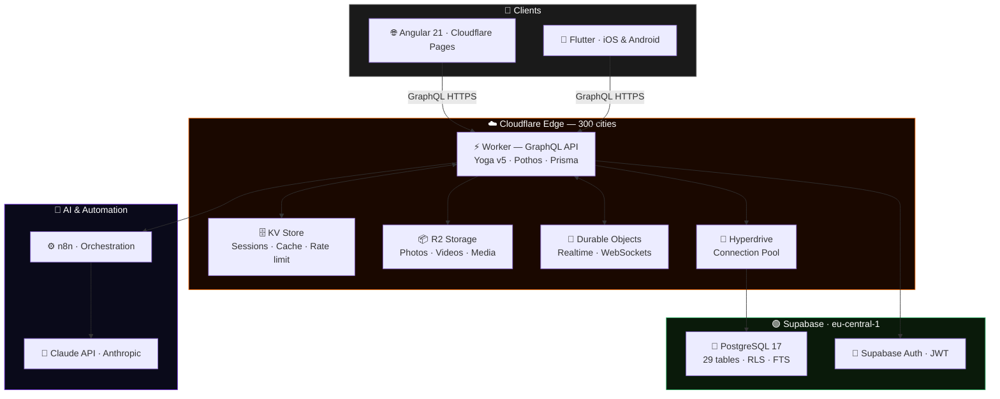

<div align="center">


<br/>

<a href="https://savorealo.com">
  
</a>

<br/><br/>

<a href="https://savorealo.com">
  
</a>
&nbsp;

&nbsp;

&nbsp;


<br/><br/>

<!-- Language switcher -->
<a href="./README.md">
  
</a>
&nbsp;


<br/><br/>


</div>

<br/>

## What is Savorealo?

**Savorealo** is the first 100% gastronomic social network with integrated AI. Users publish recipes, food posts and restaurant reviews — and if they don't know what to cook, they tell the AI what ingredients they have and within seconds they receive a personalised recipe ready to publish.

> *Not just a recipe app. It's Instagram for foodies, with an AI chef in your pocket.*

<br/>

<div align="center"></div>

<br/>

## Features

<table>
<tr>
<td width="50%">

**Social network**
- 📸 &nbsp;Personalised feed with multimedia posts
- 👥 &nbsp;Follow users and restaurants
- 💬 &nbsp;Comments, likes and saves
- 📖 &nbsp;Stories with 24h expiration
- 💌 &nbsp;Direct messages and group chats
- 🔔 &nbsp;Real-time notifications

</td>
<td width="50%">

**Gastronomy + AI**
- 🤖 &nbsp;Recipe generator with Claude AI
- 📷 &nbsp;Upload a photo — AI identifies ingredients
- 🌾 &nbsp;Allergen and preference system
- 🗺️ &nbsp;Restaurant directory with reviews
- 🔍 &nbsp;Full-text search in Spanish
- 📊 &nbsp;Culinary categories and filters

</td>
</tr>
</table>

<br/>

<div align="center"></div>

<br/>

## Tech stack

<div align="center">

**Frontend & Mobile**

<a href="https://skillicons.dev">
  
</a>

<br/><br/>

**Backend & Infrastructure**

<a href="https://skillicons.dev">
  
</a>

<br/><br/>

**AI, Automation & DevOps**

<a href="https://skillicons.dev">
  
</a>

</div>

<br/>

<details>
<summary><b>📋 Full stack table</b></summary>
<br/>

| Layer | Technology | Version | Notes |
|---|---|---|---|
| **Web framework** | Angular | 21.x | Signals + Zoneless |
| **UI Components** | PrimeNG + Tailwind CSS | 21.x / v4 | Custom design system |
| **Mobile** | Flutter + Dart | 3.x | iOS and Android |
| **Native modules** | Kotlin | — | Android |
| **API** | GraphQL Yoga v5 | latest | The Guild, spec-compliant |
| **GraphQL schema** | Pothos | latest | Code-first, type-safe |
| **ORM** | Prisma + Edge | latest | With Prisma Accelerate |
| **Backend runtime** | Cloudflare Workers | — | Edge serverless, 300 cities |
| **Database** | PostgreSQL 17 | via Supabase | 29 tables, RLS, FTS Spanish |
| **Auth** | Supabase Auth | latest | JWT + OAuth |
| **Media storage** | Cloudflare R2 | — | No egress fees |
| **Cache / Sessions** | Cloudflare KV | — | Edge-distributed |
| **Realtime** | Cloudflare Durable Objects | — | Persistent WebSockets |
| **Connection pool** | Cloudflare Hyperdrive | — | Workers → Supabase |
| **Generative AI** | Claude API (Anthropic) | Sonnet 4 | Recipe generation |
| **AI orchestration** | n8n | — | AI → DB workflow |
| **Language** | TypeScript 5 strict | 5.x | End-to-end type safety |
| **Testing** | Vitest + Playwright | latest | Unit + E2E |
| **CI/CD** | GitHub Actions | — | Automatic deploy |

</details>

<br/>

<div align="center"></div>

<br/>

## Architecture



> **Edge-first.** No servers to manage. No manual scaling. Automatic HTTPS. Deploy in seconds. Estimated MVP cost: **~€5–10/month**.

<br/>

<div align="center"></div>

<br/>

## Database

<div align="center">


&nbsp;

&nbsp;

&nbsp;


</div>

<br/>

<table>
<tr>
<td width="33%" valign="top">

**👤 Users & Social**
```
users
person_profiles
business_profiles
user_settings
follows
```
**🌾 Allergens & Prefs**
```
allergens
allergen_ingredients
user_allergies
preferences
user_preferences
```

</td>
<td width="33%" valign="top">

**📝 Content**
```
posts          ← polymorphic
recipes        ← post extension
ingredients
recipe_ingredients
post_media
```
**❤️ Interactions**
```
likes
comments
saved_posts
viewed_posts
```

</td>
<td width="33%" valign="top">

**💬 Messaging**
```
conversations
conversation_participants
direct_messages
contacts
```
**🔔 Events & AI**
```
notifications
feed_events
places
place_reviews
ai_generations
```

</td>
</tr>
</table>

<br/>

<div align="center"></div>

<br/>

## AI generation — the differentiator

<div align="center">

</div>

<br/>

| Flow | Input | Process |
|---|---|---|
| **Manual** | Ingredients + dietary restrictions | Claude generates → user reviews → publishes |
| **Photo** | Image of ingredients | Claude Vision identifies → same flow |
| **n8n** | Orchestration middleware | Retries, per-user rate limiting, metrics |

<br/>

<div align="center"></div>

<br/>

## Request flow

<div align="center">

</div>

<br/>

<div align="center"></div>

<br/>

## Project activity

<div align="center">

</div>

<br/>

<div align="center"></div>

<br/>

## CI/CD Pipeline

<div align="center">

</div>

<br/>

Push to any tracked branch triggers a GitHub Actions workflow that runs checks and deploys automatically — no manual steps needed.

<br/>

**Backend — Cloudflare Worker (GraphQL API)**

<div align="center">

| Branch | Project | Worker route | Trigger |
|---|---|---|---|
| `main` | `savorealo-api` | `app.savorealo.com/api/*` | Push → GitHub Actions → deploy |
| `develop` | `savorealo-api-staging` | `develop.app.savorealo.com/api/*` | Push → GitHub Actions → deploy |

</div>

<br/>

**Frontend — Cloudflare Pages (Angular 21)**

<div align="center">

| Branch | Domain | Notes | Trigger |
|---|---|---|---|
| `main` | `app.savorealo.com` | Includes internal Worker for SSR (auth page) | Push → GitHub Actions → deploy |
| `develop` | `develop.app.savorealo.com` | Includes internal Worker for SSR (auth page) | Push → GitHub Actions → deploy |

</div>

<br/>

<div align="center">

| Branch | Role |
|---|---|
| `feat/*` · `fix/*` | Local development only — no automatic deploy |

</div>

[Conventional Commits](https://www.conventionalcommits.org/) &nbsp;·&nbsp; Commitlint + Husky &nbsp;·&nbsp; PRs max 400 lines

<br/>

<div align="center"></div>

<br/>

## Repositories

<div align="center">

| Repository | Description | Main stack |
|---|---|---|
| [`savorealo-web`](#) | Angular 21 frontend | Angular · Tailwind · PrimeNG · Apollo |
| [`savorealo-mobile`](#) | Flutter iOS/Android app | Flutter · Dart · Kotlin |
| [`savorealo-api`](#) | GraphQL edge backend | Workers · Yoga v5 · Pothos · Prisma |
| [`savorealo-infra`](#) | Cloudflare configuration | Wrangler · IaC |

> 🔒 Private repositories — request access from the team.

</div>

<br/>

<div align="center"></div>

<br/>

## Local development

<details>
<summary><b>⚡ Backend — GraphQL API (Cloudflare Workers)</b></summary>
<br/>

```bash
cd savorealo-api
npm install
cp .env.example .env        # fill in Supabase + Cloudflare credentials
wrangler dev                # → http://localhost:8787/graphql
```
</details>

<details>
<summary><b>🌐 Web frontend — Angular 21</b></summary>
<br/>

```bash
cd savorealo-web
npm install
cp environments/environment.example.ts environments/environment.ts
ng serve                    # → http://localhost:4200
```
</details>

<details>
<summary><b>📱 Mobile — Flutter</b></summary>
<br/>

```bash
cd savorealo-mobile
flutter pub get
flutter run
```
</details>

<br/>

<div align="center"></div>

<br/>

## Team

<div align="center">

<table>
<tr>
  <td align="center" width="50%">
    <br/>
    
    <br/><br/>
    <sub>Angular 21 · GraphQL API · Cloudflare Workers · TypeScript</sub>
    <br/><br/>
  </td>
  <td align="center" width="50%">
    <br/>
    
    <br/><br/>
    <sub>Flutter · Dart · iOS · Android · Kotlin</sub>
    <br/><br/>
  </td>
</tr>
</table>

<br/>


<br/><br/>


<br/>


</div>
